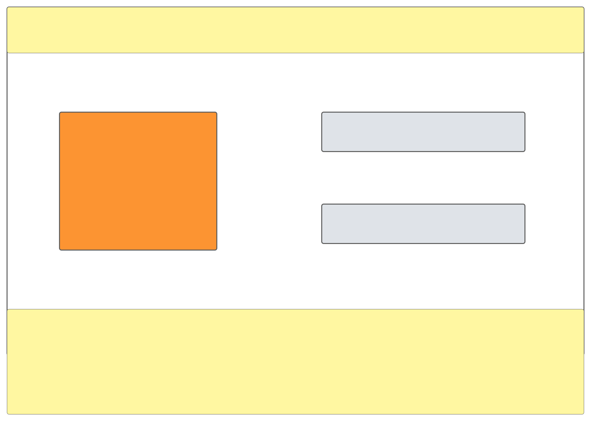
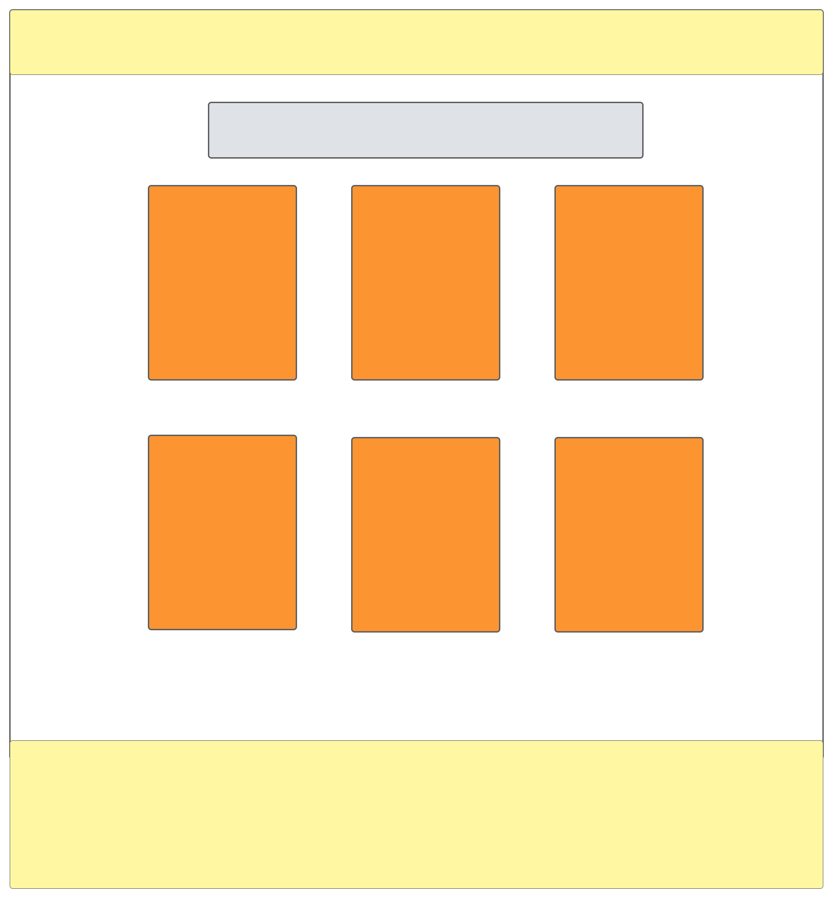
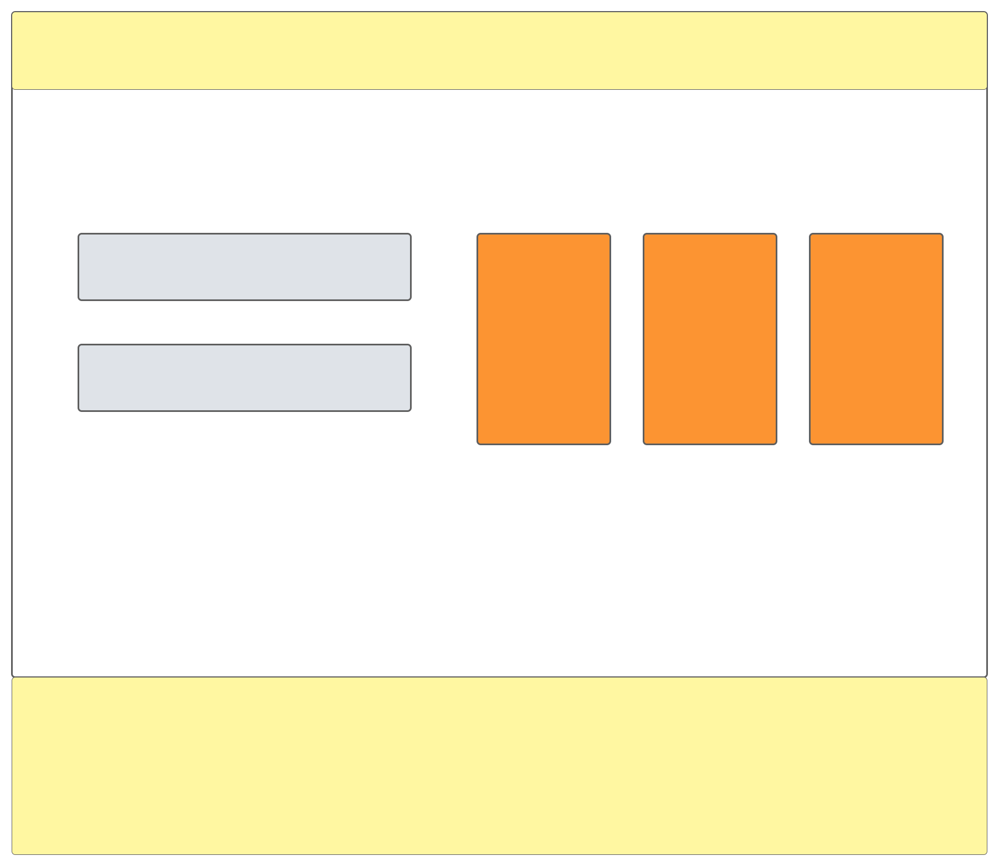

<h1>Proyecto 4: Hooks y Props</h1>
En este proyecto se pusieron en práctica con los conocimientos teóricos del uso de los hooks y las props de React.
Este es el proyecto numero 4, la web de una pizzería.

<h2>Elementos del proyecto</h2>

1. CSS
2. HTML5
3. Javascript
4. React
5. Bootstrap

## WireFrames del proyecto
#Index: Pagina principal donde se puede acceder a cualquier directorio desde el nav.

#Nuestro menu: Directorio donde el usuario puede ver los diferentes platos de la pizzería, los datos son obtenidos de un acrhivo json.

#Reservaciones: Directorio donde el usuario puede reservar una mesa de las 3 disponibles, los datos de las mesas son dadas por un archivo json.

<h2>Despliegue</h2>
https://sebaaguilera-hub.github.io/proyecto-4-react/menu

